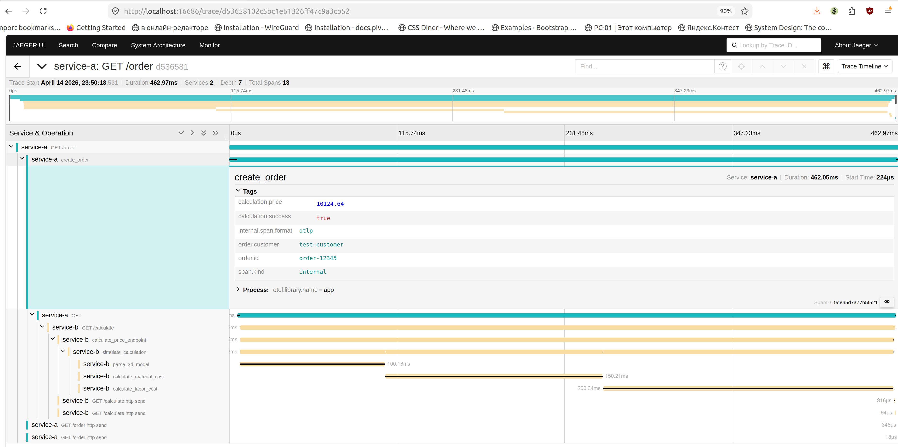

# Jaeger в Minikube с OpenTelemetry-инструментированными сервисами

## Описание
Демонстрация распределенной трассировки с использованием OpenTelemetry и Jaeger в Kubernetes (Minikube).

**Архитектура:**
- **Service A (Order Service)** — сервис заказов на FastAPI, вызывает Service B
- **Service B (Calculation Service)** — сервис расчета стоимости на FastAPI
- **Jaeger** — сбор, хранение и визуализация трейсов

Оба сервиса инструментированы OpenTelemetry SDK и автоматически отправляют трейсы в Jaeger через OTLP/gRPC.

## Требования
| Компонент | Версия | Проверка |
|-----------|--------|----------|
| Minikube | >= 1.32.0 | `minikube version` |
| kubectl | >= 1.28 | `kubectl version --client` |
| Docker | >= 24.0 | `docker --version` |

## Установка

### 1. Запуск Minikube 
```bash
cd architecture-alexandrite-k8s-trace-main/

# Запускаем кластер с 2 CPU и 4 GB RAM
minikube start --cpus=2 --memory=4096 --addons=ingress

# Проверяем статус
minikube status
```
Ingress нужен для вызовов.

### 2. Установка cert-manager (требуется для Jaeger Operator)
```bash
kubectl apply -f https://github.com/cert-manager/cert-manager/releases/download/v1.13.3/cert-manager.yaml

# Ждем, пока cert-manager запустится
kubectl wait --namespace cert-manager \
  --for=condition=ready pod \
  --selector=app.kubernetes.io/component=controller \
  --timeout=120s
```

### 3. Установка Jaeger Operator и развертывание Jaeger
```bash
# Создаем namespace
kubectl create namespace observability

# Устанавливаем Jaeger all-in-one напрямую (MVP)
kubectl apply -n observability -f - <<EOF
apiVersion: apps/v1
kind: Deployment
metadata:
  name: jaeger
  labels:
    app: jaeger
spec:
  replicas: 1
  selector:
    matchLabels:
      app: jaeger
  template:
    metadata:
      labels:
        app: jaeger
    spec:
      containers:
        - name: jaeger
          image: jaegertracing/all-in-one:1.51.0
          ports:
            - containerPort: 16686
              name: query
            - containerPort: 4317
              name: grpc-otlp
            - containerPort: 4318
              name: http-otlp
          env:
            - name: COLLECTOR_OTLP_ENABLED
              value: "true"
          resources:
            requests:
              memory: "256Mi"
              cpu: "100m"
            limits:
              memory: "512Mi"
              cpu: "500m"
          readinessProbe:
            httpGet:
              path: /
              port: 16686
            initialDelaySeconds: 5
            periodSeconds: 5
          livenessProbe:
            httpGet:
              path: /
              port: 16686
            initialDelaySeconds: 15
            periodSeconds: 10
---
apiVersion: v1
kind: Service
metadata:
  name: jaeger-query
  labels:
    app: jaeger
spec:
  selector:
    app: jaeger
  ports:
    - name: query
      port: 16686
      targetPort: 16686
---
apiVersion: v1
kind: Service
metadata:
  name: jaeger-collector
  labels:
    app: jaeger
spec:
  selector:
    app: jaeger
  ports:
    - name: grpc-otlp
      port: 4317
      targetPort: 4317
    - name: http-otlp
      port: 4318
      targetPort: 4318
EOF

# Ждем готовности оператора
kubectl wait --namespace observability \
  --for=condition=ready pod \
  --selector=app=jaeger \
  --timeout=120s

# Проверяем статус
kubectl get pods -n observability
# Ожидаемый вывод:
NAME                    READY   STATUS    RESTARTS   AGE
jaeger-b57c77b4-n92l5   1/1     Running   0          28s

kubectl get svc -n observability
# Ожидаемый вывод:
NAME               TYPE        CLUSTER-IP       EXTERNAL-IP   PORT(S)             AGE
jaeger-collector   ClusterIP   10.96.225.21     <none>        4317/TCP,4318/TCP   37s
jaeger-query       ClusterIP   10.106.213.163   <none>        16686/TCP           37s
```

### 4. Сборка Docker-образов сервисов
---
#### Возврат Docker в исходное состояние (после завершения всех шагов ниже)
##### Что делает команда `eval $(minikube docker-env)`?
Когда вы выполняете `eval $(minikube docker-env)`, ваш терминал временно перенаправляет
команды Docker на демон Docker, работающий **внутри виртуальной машины Minikube**.

**До выполнения команды:**
```
docker build → Собирает образ в вашей системе
docker images → Показывает образы вашей системы
```

**После выполнения команды:**
```
docker build → Собирает образ внутри Minikube
docker images → Показывает образы внутри Minikube
```

Это необходимо, потому что Kubernetes в Minikube видит только те Docker-образы,
которые находятся внутри его собственной виртуальной машины.

##### Как проверить, с каким Docker вы сейчас работаете?
```bash
# Эта команда покажет, где находится Docker-демон
echo $DOCKER_HOST

# Вывод, если вы подключены к Minikube:
tcp://192.168.49.2:2376

# Вывод, если вы используете системный Docker:
# Пустая строка или сообщение об ошибке
```

##### Как вернуть Docker в обычный режим?
```bash
# Отключаем Minikube Docker и возвращаем системный
eval $(minikube docker-env --unset)
```

---

```bash
# Переключаем Docker на Minikube
eval $(minikube docker-env)

# Собираем образы
minikube image build -t service-a:latest services/service-a/
minikube image build -t service-b:latest services/service-b/

# Проверяем, что образы загружены
minikube image list | grep service-
```

### 5. Развертывание сервисов
```bash
kubectl apply -f k8s/services.yaml

# Ждем готовности подов
kubectl wait --for=condition=ready pod -l app=service-a --timeout=60s

kubectl wait --for=condition=ready pod -l app=service-b --timeout=60s

# Проверяем статус
kubectl get pods
# Ожидаемый вывод:
NAME                         READY   STATUS    RESTARTS   AGE
service-a-7fc9d56866-6kp89   1/1     Running   0          52s
service-b-8d78d6955-m8wdt    1/1     Running   0          52s

kubectl get services
# Ожидаемый вывод:
NAME         TYPE        CLUSTER-IP      EXTERNAL-IP   PORT(S)    AGE
kubernetes   ClusterIP   10.96.0.1       <none>        443/TCP    32m
service-a    ClusterIP   10.99.154.209   <none>        8080/TCP   96s
service-b    ClusterIP   10.109.239.92   <none>        8080/TCP   96s
```

## Тестирование трассировки

### Способ 1: Прямой вызов через wget (рекомендуемый)
```bash
# Выполняем команду внутри пода service-a
kubectl exec -it $(kubectl get pods -l app=service-a -o jsonpath='{.items[0].metadata.name}') -- curl -s http://service-a:8080/order | jq
```

**Ожидаемый ответ:**
```json
{
  "order_id": "order-12345",
  "status": "created",
  "calculation": {
    "price": 16231.33,
    "currency": "RUB",
    "polygon_count": 73947,
    "estimated_hours": 7.39,
    "breakdown": {
      "material": 3139.28,
      "labor": 11092.05,
      "markup": 2000
    },
    "trace_id": "dc3660b5df62148b60c363a4287f25bb"
  },
  "trace_id": "dc3660b5df62148b60c363a4287f25bb"
}
```

### Способ 2: Порт-форвард и curl
```bash
# В одном терминале пробрасываем порт
kubectl port-forward svc/service-a 8080:8080

# В другом терминале
curl http://localhost:8080/order
```

### Способ 3: Прямой вызов service-b (для проверки)
```bash
kubectl exec -it $(kubectl get pods -l app=service-a -o jsonpath='{.items[0].metadata.name}') -- curl -s http://service-b:8080/calculate | jq
```

### Способ 4: Интерактивный вход в под и тестирование
```bash
# Войти в под service-a
kubectl exec -it $(kubectl get pods -l app=service-a -o jsonpath='{.items[0].metadata.name}') -- /bin/bash

# Внутри пода выполнить
curl http://service-a:8080/order
curl http://service-a:8080/health
curl http://service-b:8080/calculate
curl http://service-b:8080/health

# Выйти
exit
```

## Просмотр трейсов в Jaeger UI

### Открытие Jaeger UI
```bash
# Пробрасываем порт Jaeger Query
kubectl port-forward -n observability svc/jaeger-query 16686:16686
```

Откройте браузер и перейдите по адресу: http://localhost:16686

### Поиск трейса
1. В выпадающем списке Service выберите service-a
2. В выпадающем списке Operation выберите create_order
3. Нажмите кнопку Find Traces
4. Кликните на найденный трейс для просмотра деталей

#### Что вы должны увидеть:
- Полный путь запроса: `service-a` → `service-b`
- Вложенные спаны для каждого этапа расчета
- Атрибуты спанов: `order.id`, `calculation.price`

**Пример скриншота:**


## Остановка и очистка
```bash
# Удаляем сервисы
kubectl delete -f k8s/services.yaml

# Удалить deployment и сервисы Jaeger
kubectl delete deployment jaeger -n observability
kubectl delete service jaeger-query -n observability
kubectl delete service jaeger-collector -n observability

# Проверить, что всё удалено
kubectl get all -n observability
# Ожидаемый вывод:
# No resources found in observability namespace.

# Отключаем Minikube Docker и возвращаем системный
eval $(minikube docker-env --unset)

# Останавливаем Minikube
minikube stop

# Полная очистка
minikube delete
```

## Структура проекта
```
.
├── k8s/
│   ├── jaeger-instance.yaml    # Конфигурация Jaeger all-in-one (НЕ используется в MVP)
│   └── services.yaml           # Деплоймент и сервисы для service-a и service-b
├── services/
│   ├── service-a/
│   │   ├── app.py              # Исходный код Order Service
│   │   ├── requirements.txt    # Python-зависимости
│   │   └── Dockerfile          # Инструкция сборки образа
│   └── service-b/
│       ├── app.py              # Исходный код Calculation Service
│       ├── requirements.txt    # Python-зависимости
│       └── Dockerfile          # Инструкция сборки образа
├── screenshots/
│   └── jaeger-trace.png        # Скриншот трейса из Jaeger UI
└── README.md                   # Эта инструкция
```