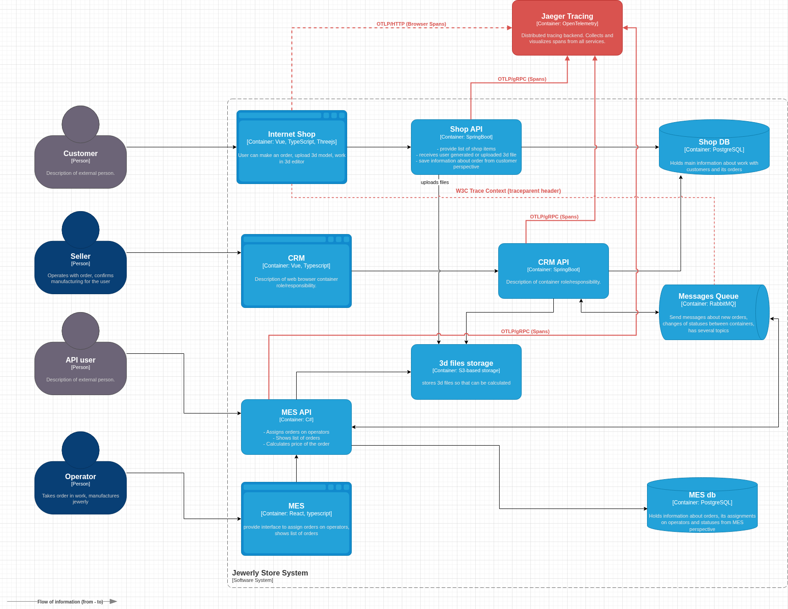
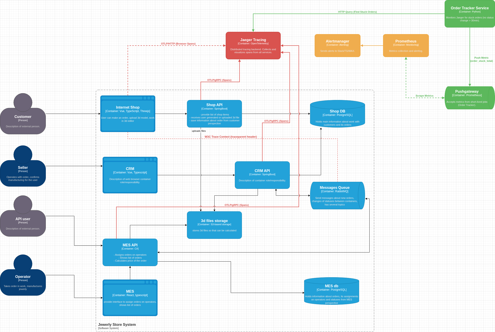

# Архитектурное решение по трейсингу

## 1. Анализ системы и идентификация критических точек

На основе C4-диаграммы и описания бизнес-процесса были выявлены следующие точки потенциального отказа, где заказ может "сломаться" или потеряться:

1.  **Internet Shop -> Shop API (HTTP):** Потеря запроса на создание заказа из-за сетевых таймаутов или ошибки 500.
2.  **Shop API -> Shop DB (SQL):** Транзакция записи статуса `SUBMITTED` может не пройти, но пользователь получит ложное подтверждение.
3.  **CRM API -> RabbitMQ (AMQP):** Публикация сообщения о статусе `MANUFACTURING_APPROVED` может не дойти до брокера.
4.  **RabbitMQ -> MES API (AMQP):** Сообщение может "застрять" в очереди или быть отвергнуто консьюмером (MES API) из-за ошибки десериализации.
5.  **MES API -> 3D Files Storage (S3 API):** Сбой при скачивании файла для расчета стоимости из-за сетевых проблем или неверных прав доступа.
6.  **MES API -> MES DB (SQL):** Запись статуса `PRICE_CALCULATED` может быть не выполнена, хотя расчет произведен.

**Покрытие трейсингом:**
Трейсингом должны быть покрыты все сервисы внутри контура `Jewerly Store System`, а именно:
*   `Shop API`
*   `CRM API`
*   `MES API`
*   Асинхронные вызовы через `RabbitMQ`.

## 2. Список данных, попадающих в трейсинг (Trace Attributes)

Для эффективного поиска и отладки в каждый спан (span) должны добавляться следующие атрибуты:

| Категория | Название атрибута | Описание | Пример |
| :--- | :--- | :--- | :--- |
| **Обязательные** | `trace_id` | Сквозной идентификатор запроса. Генерируется на входе (Internet Shop). | `a1b2c3d4e5f67890` |
| | `span_id` | Идентификатор конкретной операции. | `1234567890abcdef` |
| | `service.name` | Имя сервиса. | `shop-api` |
| **Бизнес-контекст** | `order.id` | **Критично.** Идентификатор заказа в системе. Позволяет найти заказ в трейсе. | `order-12345` |
| | `order.status` | Текущий статус заказа в момент операции. | `PRICE_CALCULATED` |
| | `user.id` | Идентификатор пользователя (или API-клиента). | `user@example.com` |
| **Технический контекст** | `http.method` | HTTP-метод. | `POST` |
| | `http.url` | Путь запроса. | `/api/orders/calculate` |
| | `http.status_code` | Код ответа. | `200` или `500` |
| | `messaging.system` | Тип очереди. | `rabbitmq` |
| | `messaging.destination` | Название очереди/топика. | `order.price.calculation` |
| | `exception.message` | Текст ошибки, если она произошла. | `SQLException: Connection timeout` |

## 3. Мотивация

Внедрение трейсинга критически необходимо для выхода из кризиса с потерянными заказами.

**Почему трейсинг необходим прямо сейчас?**
Сейчас, когда заказ пропадает или зависает, диагностика выглядит так:
1. Менеджер находит заказ в CRM.
2. Разработчик лезет в логи `Shop API`.
3. Если там пусто, просит залезть в логи `MES API` (другой стек, другой доступ).
4. Если и там пусто, смотрит в консоль RabbitMQ.

Это занимает часы или дни. **Трейсинг с `order.id` сокращает время поиска до 30 секунд**: вводим номер заказа в Jaeger -> видим всю цепочку вызовов и красный спан в месте ошибки.

**Метрики, на которые повлияет внедрение:**
1.  **MTTD (Mean Time to Detect):** Время обнаружения потери заказа снизится с нескольких дней (жалоба клиента) до нескольких минут (алерт по незавершенным трейсам).
2.  **MTTR (Mean Time to Resolve):** Время исправления бага с неправильной десериализацией сообщения снизится с 4-6 часов до 30 минут.
3.  **Количество "зависших" заказов:** Уменьшится на 90% за счет выявления и устранения систематических ошибок интеграции.
4.  **Conversion Rate (B2B API):** Вырастет на 5-10% за счет снижения числа таймаутов при расчете цены (увидим узкое место и оптимизируем).
5.  **Трудозатраты команды поддержки:** Снизятся на 20 часов в неделю.

## 4. Предлагаемое решение

Для реализации трейсинга предлагается использовать стек **OpenTelemetry + Jaeger**. Это полностью соответствует отраслевым стандартам.

**Технологический стек:**
*   **Сбор данных:** OpenTelemetry SDK (встроен в приложения).
*   **Протокол:** OTLP (OpenTelemetry Protocol) поверх gRPC или HTTP.
*   **Бэкенд и визуализация:** **Jaeger**.
*   **Инструментирование кода:**
    *   **Java (Spring Boot - Shop, CRM):** Библиотека `micrometer-tracing-bridge-otel`. Она автоматически создает спаны для всех HTTP-запросов и SQL-запросов.
    *   **C# (MES API):** Nuget-пакет `OpenTelemetry.Extensions.Hosting`. Аналогично инструментирует входящие HTTP и исходящие SQL.
    *   **RabbitMQ:** Использование заголовков сообщений для передачи `traceparent` (W3C Trace Context).

**Новые компоненты (выделены красным на схеме):**
1.  **Jaeger Collector / Jaeger All-in-One:** Сервис, развернутый в отдельном контейнере или инстансе EC2. Принимает данные по OTLP (порт 4317/gRPC или 4318/HTTP).
2.  **Jaeger UI:** Веб-интерфейс для поиска трейсов (порт 16686).
3.  **Jaeger Storage:** Встроенное хранилище (Badger) или внешнее (Elasticsearch).

**Схема архитектуры с трейсингом (Новые элементы выделены красным):**

*Исходный файл схемы:* [c4_tracing_red.drawio](./schemes/c4_tracing_red.drawio)

**Описание изменений на схеме:**
*   Добавлен контейнер `Jaeger Tracing` с технологией `OpenTelemetry`.
*   Добавлены связи (красные стрелки) от `Shop API`, `CRM API`, `MES API` к `Jaeger Tracing` с типом `gRPC/OTLP`.
*   Добавлены связи передачи контекста через заголовки между `Internet Shop -> Shop API -> CRM API -> RabbitMQ -> MES API` (логическая связь W3C Trace Context).

## 5. Компромиссы

Внедрение трейсинга сопряжено со следующими ограничениями и издержками:

1.  **Сложность в проприетарном MES:** Код MES куплен вместе с исходниками, но команда разработчиков C# всего одна. Может потребоваться больше времени на внедрение `OpenTelemetry` в C# часть, если там нестандартная архитектура.
2.  **Трейсинг работы GPU:** Сам расчет 3D модели (CPU/GPU-bound операция) может быть "черным ящиком" для OTel. Мы увидим только время выполнения метода `CalculatePrice()`, но не увидим детали внутри рендеринга. Это допустимо на первом этапе.
3.  **Накладные расходы (Overhead):** Сбор и отправка трейсов добавляет 1-5% к нагрузке на CPU сервисов. Учитывая текущую низкую производительность MES, на время пилотного проекта имеет смысл настроить **Sampling (семплирование)** — собирать 100% трейсов для ошибок и 10% успешных запросов.
4.  **Безопасность данных 3D моделей:** Сами файлы моделей не должны попадать в трейсы (тело запроса). OTel по умолчанию не записывает тело больших запросов, но мы явно отключим запись тела в конфигурации `http.body` для эндпоинтов загрузки.

## 6. Аспекты безопасности

Для предотвращения утечки чувствительных данных (персональные данные клиентов, `order.id`, которые могут быть коммерческой тайной) предусмотрены следующие меры:

1.  **Сетевая изоляция:** `Jaeger Collector` и `Jaeger UI` разворачиваются во внутренней VPC (виртуальное частное облако) без публичного IP-адреса.
2.  **Доступ для разработчиков:** Доступ к Jaeger UI осуществляется **только через VPN** (WireGuard/OpenVPN) внутрь контура `dev`/`prod` или через проброс портов SSH (SSH Tunneling) на Bastion Host.
3.  **Аутентификация (перспектива):** В первой итерации аутентификация не включается (так как доступ только по VPN). В будущем возможно включение Basic Auth перед Jaeger через Nginx reverse proxy.
4.  **Маскирование данных:** В коде приложений настроить фильтры `SpanProcessor`, который вырезает значения `Authorization` header и номера кредитных карт, если они вдруг появятся в атрибутах.

---

## 7. Дополнительное задание: Автоматический мониторинг процесса заказа и алертинг

**Концепция:** С помощью трейсинга мы можем отслеживать **сквозное время прохождения заказа** (End-to-End Latency) и факт его "зависания".

**Реализация:**
1.  **Сбор данных:** В `Jaeger` настраивается регулярный фоновая задача (например, скрипт на Python), который выполняет поиск по трейсам с тегом `order.status=SUBMITTED` и проверяет наличие спана `PRICE_CALCULATED` в течение 10 минут.
2.  **Метрика в Prometheus:** Скрипт записывает результат в **Prometheus Pushgateway** или напрямую в метрику `order_stuck_total`.
3.  **Алертинг:** Prometheus Alertmanager настраивается на условие: `increase(order_stuck_total[15m]) > 5`.

**Новые элементы на схеме (выделены зеленым):**
*   **Сервис мониторинга заказов (Order Tracker):** Небольшой Python-сервис (или CronJob в K8s), который читает API Jaeger.
*   **Pushgateway:** Компонент для приема метрик от короткоживущих задач.
*   **Alertmanager:** Уже учтен в плане по мониторингу (Task 2), здесь используется для отправки алертов о потерянных заказах в Slack/ТГ/MAX.

*Исходный файл схемы: [c4_tracing_alerting_green.drawio](./schemes/c4_tracing_alerting_green.drawio)*

**Описание зеленых связей на схеме:**
1.  `Order Tracker Service -> Jaeger API (HTTP)`: Запрос трейсов.
2.  `Order Tracker Service -> Pushgateway (HTTP)`: Отправка метрики.
3.  `Prometheus -> Pushgateway (Pull)`: Сбор метрики.