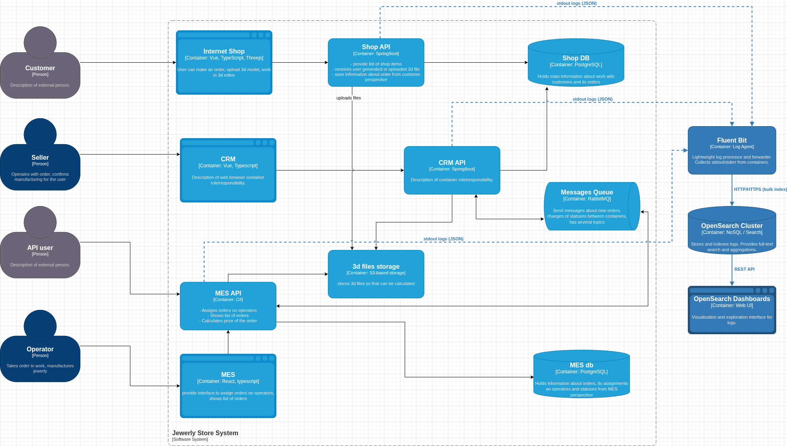

# Архитектурное решение по логированию

## 1. Мотивация

Текущий подход к расследованию инцидентов в компании «Александрит» основан на субъективных описаниях клиентов и длительном ручном анализе разрозненных логов на отдельных серверах. В условиях роста заказов и появления B2B-API это приводит к:

- **Высокому времени разрешения инцидентов (MTTR)** — часы или дни на поиск потерянного заказа.
- **Повышенной нагрузке на команду поддержки и разработки** — рутинный сбор логов с трёх разных систем.
- **Невозможности проактивного обнаружения проблем** — о сбоях узнаём только из жалоб.

Внедрение централизованного логирования позволит:

1. Снизить MTTR по критическим инцидентам с нескольких часов до минут.
2. Сократить время, затрачиваемое командой поддержки на сбор контекста по заявке, на 60–70%.
3. Обнаруживать аномалии (например, всплеск ошибок 500 или DDoS-атаки) в реальном времени.
4. Обеспечить соответствие требованиям партнёров по SLA за счёт прозрачного аудита статусов заказов.
5. Создать основу для предиктивной аналитики (прогнозирование пиковых нагрузок на производство).

**Метрики, на которые повлияет внедрение:**

| Метрика | Текущее состояние | Целевое состояние |
|---------|-------------------|-------------------|
| MTTR (среднее время восстановления) | 4–48 часов | < 30 минут |
| Доля заказов с неизвестным статусом | ~5% (оценка) | < 0.5% |
| Время на сбор логов по инциденту | 2–4 человеко-часа | < 5 минут |
| Количество эскалаций в разработку (L3) | 20/неделя | 5/неделя |

## 2. Анализ системы и состав собираемых логов

На основе C4-диаграммы `jewerly_c4_model.drawio.xml` определены источники логов:

- `Shop API` (Spring Boot)
- `CRM API` (Spring Boot)
- `MES API` (C#)
- `RabbitMQ` (брокер сообщений)
- Базы данных `Shop DB` и `MES DB` (PostgreSQL)

**Уровни логирования и их использование:**

| Уровень | Когда используется | Пример |
|---------|-------------------|--------|
| **ERROR** | Исключения, нарушающие бизнес-логику или работоспособность сервиса. | Ошибка подключения к БД, невозможность опубликовать сообщение в RabbitMQ. |
| **WARN** | Потенциально опасные ситуации, не приводящие к немедленному отказу. | Повторная попытка обработки сообщения, приближение к лимиту соединений. |
| **INFO** | Ключевые бизнес-события и изменения состояний. | Изменение статуса заказа, начало/завершение расчёта стоимости. |
| **DEBUG** | Детальная информация для отладки (включается только в dev-окружении). | Содержимое DTO перед отправкой, параметры SQL-запросов. |

**Список обязательных INFO-событий:**

| Источник | Событие | Поля лога |
|----------|---------|-----------|
| Shop API | Создание заказа | `timestamp`, `level=INFO`, `service=shop-api`, `orderId`, `customerId`, `status=SUBMITTED`, `traceId` |
| CRM API | Подтверждение производства | `timestamp`, `level=INFO`, `service=crm-api`, `orderId`, `sellerId`, `status=MANUFACTURING_APPROVED`, `traceId` |
| MES API | Начало расчёта стоимости | `timestamp`, `level=INFO`, `service=mes-api`, `orderId`, `fileSizeBytes`, `traceId` |
| MES API | Завершение расчёта стоимости | `timestamp`, `level=INFO`, `service=mes-api`, `orderId`, `calculatedPrice`, `durationMs`, `traceId` |
| MES API | Назначение заказа оператору | `timestamp`, `level=INFO`, `service=mes-api`, `orderId`, `operatorId`, `status=MANUFACTURING_STARTED`, `traceId` |
| MES API | Завершение производства | `timestamp`, `level=INFO`, `service=mes-api`, `orderId`, `operatorId`, `status=MANUFACTURING_COMPLETED`, `traceId` |
| RabbitMQ | Публикация сообщения | (через логи сервисов) `messageId`, `routingKey`, `exchange` |
| PostgreSQL | Медленные запросы | `duration`, `query` (анонимизировано), `database` |

**Примечание:** Все записи обязательно включают `traceId`, связывающий лог с конкретным трейсом (см. Task3).

## 3. Приоритизация внедрения

Одновременное покрытие всех систем логированием и трейсингом невозможно из-за ограниченных ресурсов команды (8 разработчиков + 1 DevOps). Предлагается следующий порядок:

| Приоритет | Системы | Обоснование |
|-----------|---------|-------------|
| **P0** | `Shop API`, `MES API` | Наиболее частые точки потери заказов: приём заказа и расчёт стоимости. Покрытие этих двух сервисов даст 80% диагностической ценности. |
| **P1** | `CRM API`, `RabbitMQ` | CRM — источник подтверждения заказа. RabbitMQ — критичное звено асинхронной интеграции, где чаще всего теряются сообщения. |
| **P2** | `Shop DB`, `MES DB` | Логи медленных запросов важны для оптимизации дашборда MES, но могут быть добавлены позже через экспортёры БД. |

Трейсинг внедряется параллельно с логированием для систем P0 (как описано в Task3).

## 4. Предлагаемое решение

### 4.1. Технологический стек

На основе анализа критериев (см. раздел «Дополнительное задание») выбран стек **OpenSearch + Fluent Bit + OpenSearch Dashboards**.

**Архитектура сбора логов:**

- **Агент на узлах:** Fluent Bit (легковесный, низкое потребление памяти) в качестве DaemonSet в Kubernetes или сервиса на EC2.
- **Транспорт:** Прямая отправка в OpenSearch по HTTP/HTTPS (сжатие gzip).
- **Хранилище и индексация:** OpenSearch (форк Elasticsearch 7.10 с лицензией Apache 2.0).
- **Визуализация:** OpenSearch Dashboards.
- **Конвейер обработки:** Logstash не используется (избыточен для текущих объёмов). Fluent Bit выполняет парсинг JSON и обогащение метаданными (pod name, namespace).

### 4.2. Новые компоненты и связи на схеме

**Изменения на C4-диаграмме (Container):**

Добавляются контейнеры (выделены синим цветом для отличия от трейсинга):
- **Fluent Bit** (агент логирования на каждом узле/инстансе)
- **OpenSearch Cluster** (хранение и индексация логов)
- **OpenSearch Dashboards** (веб-интерфейс)

**Новые связи:**
- `Shop API`, `CRM API`, `MES API` → (stdout/stderr) → `Fluent Bit` → (HTTP) → `OpenSearch`
- `OpenSearch Dashboards` → (HTTP) → `OpenSearch`

*Исходный файл схемы: [c4_logging.drawio](./schemes/c4_logging.drawio)*

### 4.3. Политика безопасности

**Чувствительные данные:** В логах могут присутствовать `customerId`, `orderId`, IP-адреса. Файлы 3D-моделей и их содержимое **не логируются**.

**Меры защиты:**
1. **Маскирование на уровне агента:** Fluent Bit выполняет замену `customerId` на хеш (SHA-256) или маску вида `cust_****1234` с помощью фильтра `modify`.
2. **Сетевая изоляция:** OpenSearch развёрнут в приватной VPC, доступ только изнутри кластера.
3. **Аутентификация и авторизация:**
   - Внутренний доступ: OpenSearch использует встроенный плагин Security с ролевой моделью (RBAC).
   - Роли:
     - `log_reader` — команда поддержки (только чтение индексов `app-logs-*`).
     - `log_admin` — DevOps/архитектор (управление индексами, шаблонами).
     - `developer` — чтение логов dev-окружения.
4. **Шифрование:** TLS для передачи данных между Fluent Bit и OpenSearch.

### 4.4. Политика хранения и управления индексами (ILM)

| Параметр | Значение |
|----------|----------|
| **Шаблон индекса** | `app-logs-YYYY.MM.DD` (ежедневная ротация) |
| **Количество шардов** | 1 primary, 1 replica (отказоустойчивость) |
| **ILM (Index Lifecycle Management):** | |
| — Hot-фаза (0–3 дня) | Данные активно пишутся и читаются. |
| — Warm-фаза (4–14 дней) | Данные редко запрашиваются, переходят на более медленные диски, шарды сжимаются (force merge). |
| — Delete-фаза (после 14 дней) | Индекс удаляется автоматически. |
| **Объём хранения** | Оценочно: ~5–10 ГБ в день → 140 ГБ на 14 дней. Диск хранилища — 500 ГБ SSD. |

### 4.5. Превращение сбора логов в систему анализа

**Алертинг:**
Настраивается через **Alerting Plugin** в OpenSearch Dashboards или интеграцию с Prometheus Alertmanager (метрики из логов).

| Алерт | Условие | Канал уведомлений |
|-------|---------|-------------------|
| Критический всплеск ошибок 500 | Более 5% запросов за 5-минутное окно завершаются с 5xx | Slack/ТГ/MAX #alerts-prod, PagerDuty |
| Отсутствие событий по заказу | Нет логов с `status=PRICE_CALCULATED` в течение 30 минут после `SUBMITTED` | Slack/ТГ/MAX  #alerts-nonprod |
| Ошибка подключения к БД | Появление лога уровня `ERROR` с текстом `Connection refused` | Slack/ТГ/MAX  #db-alerts |
| Рост очереди RabbitMQ | (из метрик) Корреляция с логами публикации/потребления | Slack/ТГ/MAX  #alerts-prod |

**Поиск аномалий:**
Используется **Anomaly Detection** плагин OpenSearch. Примеры детекторов:
- Резкое изменение количества заказов в минуту (обнаружение DDoS или всплеска заказов от B2B).
- Необычно долгое время расчёта стоимости (выявление проблем с 3D-моделями).
- Увеличение доли статусов `FILE_UPLOADED` без перехода в `SUBMITTED` (проблемы UX).

## 5. Дополнительное задание: Критерии выбора технологии

Сравнение проводилось между ELK (Elasticsearch, Logstash, Kibana), OpenSearch, Splunk и Loki.

| Критерий | ELK (Elastic) | OpenSearch | Splunk | Grafana Loki |
|----------|---------------|------------|--------|--------------|
| **Лицензия** | Elastic License (не свободная для SaaS) | Apache 2.0 (полностью открытая) | Проприетарная, дорогая | AGPLv3 |
| **Простота эксплуатации** | Высокая (Kibana удобна), но сложное лицензирование | Высокая (форк Kibana) | Очень высокая (полностью управляемый SaaS) | Средняя (требует настройки хранения в S3) |
| **Масштабируемость** | Отличная (горизонтальная) | Отличная (идентично ES) | Превосходная, но платная | Отличная (легковесная) |
| **Полнотекстовый поиск** | Отличный (Lucene) | Отличный (Lucene) | Отличный (проприетарный) | Ограниченный (только по меткам, не по телу сообщения) |
| **Экосистема и поддержка** | Огромная, но фрагментация после смены лицензии | Растущая, поддерживается AWS и сообществом | Корпоративная поддержка | Интеграция с Grafana, Prometheus |
| **Стоимость владения** | Бесплатно для self-hosted (с ограничениями) | Бесплатно | Очень высокая (>$100/ГБ) | Низкая (индексы в object storage) |

**Обоснование выбора OpenSearch:**
1. **Лицензия Apache 2.0** снимает риски, связанные с изменением политики Elastic (запрет на предоставление SaaS-доступа к Kibana без платной подписки).
2. **Полная совместимость с API Elasticsearch 7.10**, что упрощает миграцию и использование существующих инструментов (Filebeat/Fluent Bit).
3. **Наличие встроенных средств безопасности** (OpenSearch Security) и алертинга «из коробки».
4. **Поддержка ILM** для автоматического управления жизненным циклом индексов.
5. **Более низкие требования к памяти** по сравнению с последними версиями Elasticsearch (что важно для экономии ресурсов в облаке).

**Почему не Loki?** Несмотря на низкую стоимость хранения, Loki не предназначен для высокопроизводительного полнотекстового поиска по сообщениям логов (например, поиск всех записей с конкретным `orderId` среди терабайт данных). Для сценария «Александрит» критически важно быстро находить все логи по конкретному заказу.

---

## 6. План внедрения (высокоуровневый)

1. **Неделя 1–2:** Развернуть OpenSearch (3 ноды) и OpenSearch Dashboards в тестовом окружении.
2. **Неделя 3:** Настроить Fluent Bit на продуктивах `Shop API` и `MES API`. Начать запись INFO-логов.
3. **Неделя 4:** Создать дашборды для поддержки («Поиск по заказу», «Ошибки за последний час»).
4. **Неделя 5–6:** Подключить оставшиеся системы (CRM, RabbitMQ). Внедрить алертинг.